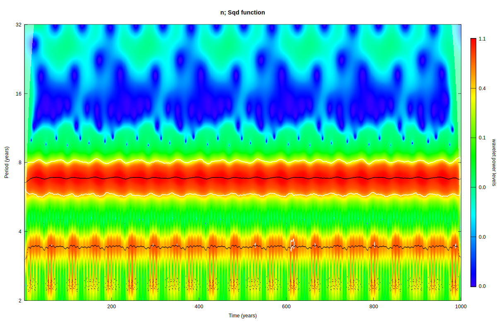
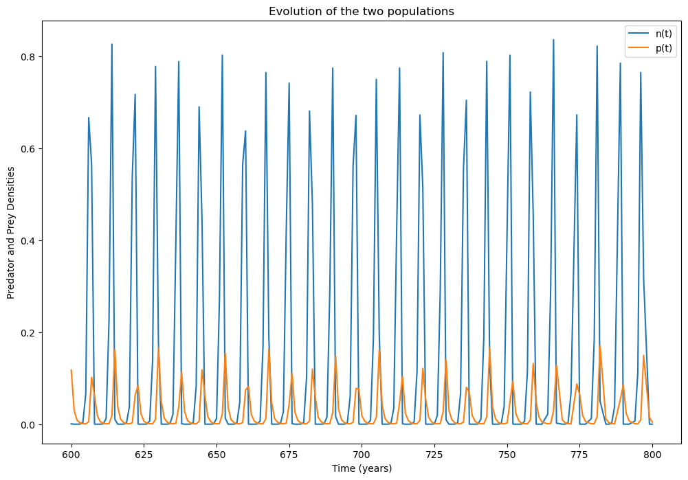
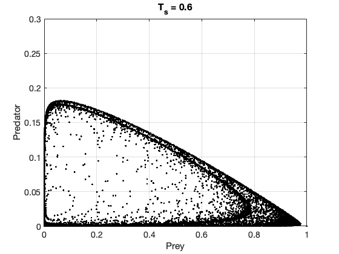
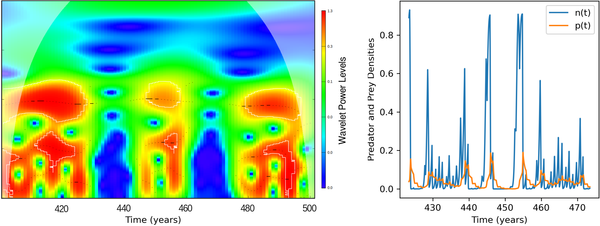
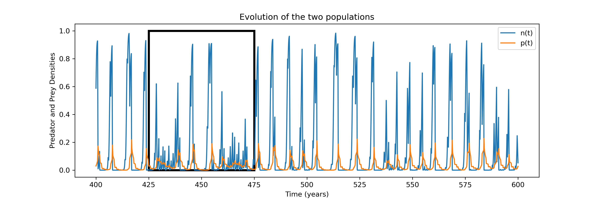
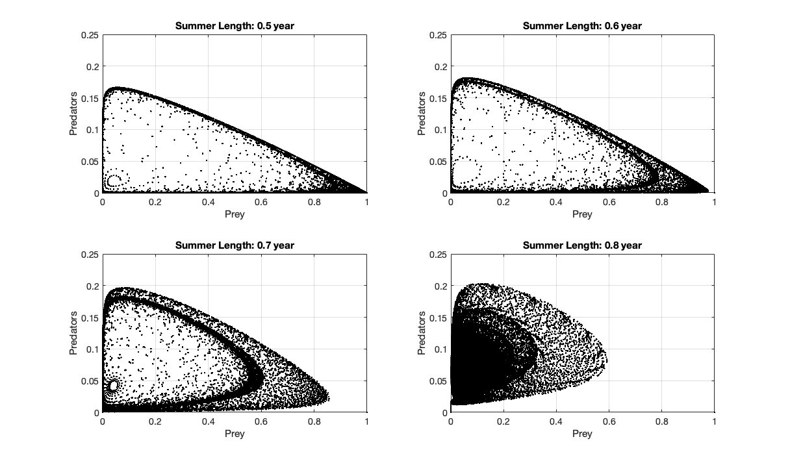
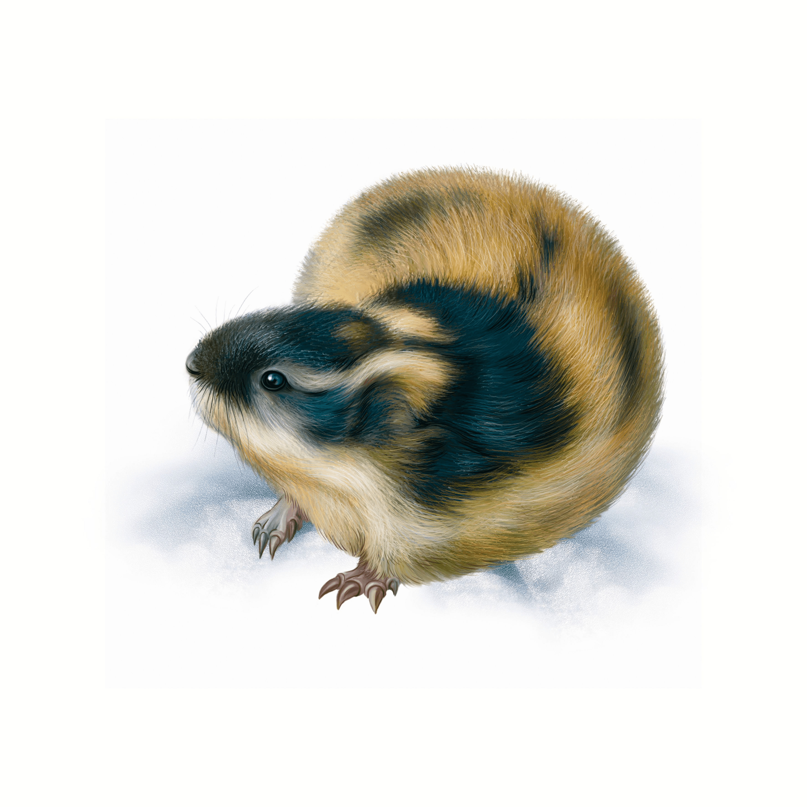

# How changes in seasonality affect the dynamics of rodent-mustelid system?
Julia Mikhailova $^a$, Nigel Yoccoz $^a$, Martin Rypdal $^b$, Nikolas Aksamit $^b$

$^a$ Department of Arctic and Marine Biology, $^b$ Department of Mathematics and Statistics, The Arctic University of Norway, Tromso, Norway 

email: <julia.mikhailova@uit.no>

## Background

* Predator-prey model for the mustelid (predator, $p$) - rodent (prey, $n$) system similar to e.g. hare-lynx system [1]
* Inspired by [2], seasonality is incorporated as shifts in predatory response from generalist (type III) in the summer to specialist (type II) in the winter
* Discrete predator-prey system with varying summer season length ($Ts$) [2]:

*Summer* $T_s$

$$     \frac{dn}{d\tau} = n(1-n) - \frac{n^2p}{\tilde{b}^2+n^2}, $$

$$    \frac{dp}{d\tau} = \tilde{\gamma} \frac{n^2p}{\tilde{b}^2+\tilde{n}^2} + \tilde{s}\frac{p}{1+\tilde{\nu}p}-\tilde{m}p $$

*Winter* $(1-T_s)$

$$     \frac{dn}{d\tau} =  - \frac{\tilde{\alpha}np}{\tilde{\beta}+n}, $$

$$    \frac{dp}{d\tau} = \tilde{\gamma} \frac{\tilde{\alpha}np}{\tilde{\beta}+n}-\tilde{\mu}p $$

| Parameter | Description 
| --------- | -----------  
| $r$         | Prey summer growth rate  
| $K$         | Prey carrying capacity
| $\alpha$  | Specialist saturation killing rate
| $\beta$   | Specialist halg-saturation
| $\gamma$    | Predator-prey ration constant
| $\mu$     | Winter predator death rate
| $s-m$      | Predator intrinsic population growth
| $\nu$       | Generalist density dependence

## Research questions

* How does stochasticity in season length ($T_s$) affecr the system's dynamics? Can it alter periodicity or amplitude?

* What type of dynamics can be expected under the current rate of climate change?

## Key results

* Stochasticity in the season length $T_s$ gives ride to transient behaviour of the system, particularly a transition between oscillation regimes
* Progressively longer and more unpredictable summers (a more realistic stochastic trend in $T_s$), what we expect in the Arctic due to climate change and Arctic amplification, lead to cycle disappearance

## Fluctuations in the system dynamics: "on-off" cycles

* Adopting an alternative function to characterize seasonal 'switch', we analyze the results of the new model

<figure align="center">
    
    <figcaption> Figure 1.1 - Wavelet spectrum for the model with a new 'switching' mechanism and no noise in the length of the summer season, T_s = 0.6 </figcaption>
</figure>

<figure align="center">
    
    <figcaption> Figure 1.2 - Time series </figcaption>
</figure>

<figure align="center">
    
    <figcaption> Figure 1.3 - Poincare map </figcaption>
</figure>

* The wavelet power spectra of the simulated time series of predator-prey dynamics with added variabilty to $T_s$

* Relatively small perturbations in the length of the season lead to irregular oscillation regimes (Fig. 2-4)

<figure align="center">
    
    <figcaption>Figure 2 - T_s = 0.6 + inc + noise(-0.05, 0.15) Wavelet spectrum of the time series (Fig. 4). Adding variability in summer length as well as a linear increase in summer length </figcaption>
</figure>

<figure align="center">
    
    <figcaption>Figure 3 - Close-up examinations of the wavelet spectrum and the time series </figcaption>
</figure>

<figure align="center">
    
    <figcaption> Figure 4 - T_s = 0.6 + inc + noise(-0.05,0.15) Simulated time series with increasing length and added variability in the summer season </figcaption>
</figure>

## Poincare maps for different season lengths

<figure align="center" >
    
    <figcaption> Figure 5 - Poincare maps for varying period length, no noise in the length of summer </figcaption>
</figure>

## Limit cycles animations
* Comparisson between 'slow' and 'fast' season transitions

<video controls width="400">
  <source src="LimitCycle_SlowFastSeasons.mp4" type="video/mp4" />
    

    Your browser doesn't support HTML video. Here is a
    <a href="myVideo.mp4">link to the video</a> instead.
  

</video>

## Discussion and Future work
* Compare results for varying distributions and variances of stochastic noise
* Estimate realistic $T_s$ values from ecological and meteorological data and test the model
* Extend the model to add another main predator (e.g., red fox for the low Arctic rodent system with least weasel and lemming)
* Explore the system's behaviour under different speeds of seasonal transitions

---
 
<figure align="center">
    
    <figcaption>  </figcaption>
</figure>

# References

1. Barraquand, F., Louca, S., Abbott, K. C., Cobbold, C. A., Cordoleani, F., DeAngelis, D. L., Elderd, B. D., Fox, J. W., Greenwood, P., Hilker, F. M., Murray, D. L., Stieha, C. R., Taylor, R. A., Vitense, K., Wolkowicz, G. S. K., & Tyson, R. C. (2017). Moving forward in circles: challenges and opportunities in modelling population cycles. Ecology Letters, 20(8), 1074–1092. https://doi.org/10.1111/ele.12789

2. Tyson, R., & Lutscher, F. (2016). Seasonally Varying Predation Behavior and Climate Shifts Are Predicted to Affect Predator-Prey Cycles. The American Naturalist, 188(5), 539–553. https://doi.org/10.1086/688665
   
3. Rinaldi, S., & Muratori, S. (1993). Conditioned chaos in seasonally perturbed predator-prey models. Ecological Modelling, 69(1-2), 79–97. https://doi.org/10.1016/0304-3800(93)90050-3

4. Torrence, C., & Compo, G. P. (1998). A practical guide to wavelet analysis. Bulletin of the American Meteorological Society, 79(1), 61–78. [https://doi.org/https://doi.org/10.1175/1520-0477(1998)079<0061:APGTWA>2.0.CO;2]
